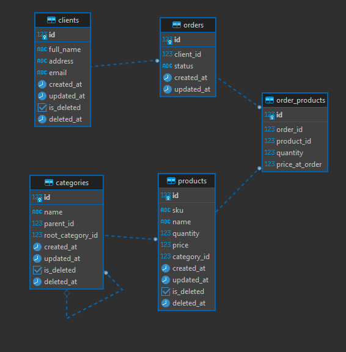

# Database Schema (Datological Schema)

## Entity Relationship Diagram



## Tables Description

### 1. `clients`

Client information.

| Column | Type | Constraints | Description |
|--------|------|-------------|-------------|
| id | INTEGER | PRIMARY KEY | Unique identifier |
| full_name | VARCHAR(255) | NOT NULL | Client name or company name |
| address | VARCHAR(500) | NULLABLE | Physical delivery address |
| email | VARCHAR(100) | UNIQUE, NOT NULL | Contact email |
| created_at | TIMESTAMP | NOT NULL, DEFAULT now() | Creation timestamp |
| updated_at | TIMESTAMP | NOT NULL, DEFAULT now() | Last update timestamp |
| is_deleted | BOOLEAN | NOT NULL, DEFAULT false | Soft delete flag |
| deleted_at | TIMESTAMP | NULLABLE | Deletion timestamp |

**Indexes:**
- `ix_clients_created_at` on `created_at`
- `ix_clients_is_deleted` on `is_deleted`
- `ix_clients_deleted_at` on `deleted_at`
- Unique index on `email`

### 2. `orders`

Order information.

| Column | Type | Constraints | Description |
|--------|------|-------------|-------------|
| id | INTEGER | PRIMARY KEY | Unique identifier |
| client_id | INTEGER | FOREIGN KEY, NOT NULL | Reference to clients.id |
| status | ENUM | NOT NULL, DEFAULT 'new' | Order status (new, processing, paid, completed, cancelled) |
| created_at | TIMESTAMP | NOT NULL, DEFAULT now() | Creation timestamp |
| updated_at | TIMESTAMP | NOT NULL, DEFAULT now() | Last update timestamp |

**Foreign Keys:**
- `client_id` → `clients.id` (ON DELETE RESTRICT)

**Indexes:**
- `ix_orders_client_id` on `client_id`
- `ix_orders_created_at` on `created_at`

### 3. `order_products`

Junction table for orders and products with additional fields (many-to-many relationship).

| Column | Type | Constraints | Description |
|--------|------|-------------|-------------|
| id | INTEGER | PRIMARY KEY | Unique identifier |
| order_id | INTEGER | FOREIGN KEY, NOT NULL | Reference to orders.id |
| product_id | INTEGER | FOREIGN KEY, NOT NULL | Reference to products.id |
| quantity | INTEGER | NOT NULL | Quantity of product in order |
| price_at_order | NUMERIC(10,2) | NOT NULL | Price at the time of order |

**Foreign Keys:**
- `order_id` → `orders.id` (ON DELETE CASCADE)
- `product_id` → `products.id` (ON DELETE RESTRICT)

**Unique Constraints:**
- `uq_order_product` on (`order_id`, `product_id`) - Prevents duplicate products in same order

### 4. `products`

Product information.

| Column | Type | Constraints | Description |
|--------|------|-------------|-------------|
| id | INTEGER | PRIMARY KEY | Unique identifier |
| sku | VARCHAR(50) | UNIQUE, NOT NULL | Stock Keeping Unit (product code) |
| name | VARCHAR(255) | NOT NULL | Product name |
| quantity | INTEGER | NOT NULL, DEFAULT 0 | Stock quantity |
| price | NUMERIC(10,2) | NOT NULL | Current price |
| category_id | INTEGER | FOREIGN KEY, NOT NULL | Reference to categories.id |
| created_at | TIMESTAMP | NOT NULL, DEFAULT now() | Creation timestamp |
| updated_at | TIMESTAMP | NOT NULL, DEFAULT now() | Last update timestamp |
| is_deleted | BOOLEAN | NOT NULL, DEFAULT false | Soft delete flag |
| deleted_at | TIMESTAMP | NULLABLE | Deletion timestamp |

**Foreign Keys:**
- `category_id` → `categories.id` (ON DELETE RESTRICT)

**Check Constraints:**
- `check_product_quantity_positive`: `quantity >= 0`

**Indexes:**
- `ix_products_sku` on `sku` (unique)
- `ix_products_category_id` on `category_id`
- `ix_products_created_at` on `created_at`
- `ix_products_is_deleted` on `is_deleted`
- `ix_products_deleted_at` on `deleted_at`

### 5. `categories`

Hierarchical category structure with unlimited nesting levels.

| Column | Type | Constraints | Description |
|--------|------|-------------|-------------|
| id | INTEGER | PRIMARY KEY | Unique identifier |
| name | VARCHAR(255) | NOT NULL | Category name |
| parent_id | INTEGER | FOREIGN KEY, NULLABLE | Reference to categories.id (NULL for root categories) |
| root_category_id | INTEGER | FOREIGN KEY, NULLABLE | Reference to categories.id — root (1-st level of hierarchy) |
| created_at | TIMESTAMP | NOT NULL, DEFAULT now() | Creation timestamp |
| updated_at | TIMESTAMP | NOT NULL, DEFAULT now() | Last update timestamp |
| is_deleted | BOOLEAN | NOT NULL, DEFAULT false | Soft delete flag |
| deleted_at | TIMESTAMP | NULLABLE | Deletion timestamp |

**Foreign Keys:**
- `parent_id` → `categories.id` (ON DELETE RESTRICT, self-reference)
- `root_category_id` → `categories.id` (ON DELETE RESTRICT, self-reference)

**Indexes:**
- `ix_categories_parent_id` on `parent_id`
- `ix_categories_root_category_id` on `root_category_id`
- `ix_categories_created_at` on `created_at`
- `ix_categories_is_deleted` on `is_deleted`
- `ix_categories_deleted_at` on `deleted_at`

## Relationships

### One-to-Many

1. **Clients → Orders**: One client can have many orders
   - Foreign key: `orders.client_id` → `clients.id`

2. **Orders → OrderProducts**: One order can have many order products
   - Foreign key: `order_products.order_id` → `orders.id`
   - Cascade delete: When order is deleted, all order_products are deleted

3. **Products → OrderProducts**: One product can be in many orders
   - Foreign key: `order_products.product_id` → `products.id`
   - Restrict delete: Cannot delete product if it's in orders

4. **Categories → Products**: One category can have many products
   - Foreign key: `products.category_id` → `categories.id`
   - Restrict delete: Cannot delete category if it has products

### Many-to-Many

1. **Orders ↔ Products**: Through `order_products` junction table
   - One order can contain multiple products
   - One product can be in multiple orders
   - Unique constraint prevents duplicate products in same order

### Self-Referential

1. **Categories → Categories**: Hierarchical structure
   - `categories.parent_id` → `categories.id`
   - Allows unlimited nesting levels
   - NULL `parent_id` indicates root category

2. **Categories → Categories** (root): Denormalization for reports
   - `categories.root_category_id` → `categories.id`
   - For each category, references the root (top-level) category
   - Filled by the application on create/update; allows to see root category in reports without recursive queries

## Example Category Tree

```
Бытовая техника (parent_id = NULL)
├── Стиральные машины (parent_id = 1)
├── Холодильники (parent_id = 1)
│   ├── однокамерные (parent_id = 3)
│   └── двухкамерные (parent_id = 3)
└── Телевизоры (parent_id = 1)

Компьютеры (parent_id = NULL)
├── Ноутбуки (parent_id = 6)
│   ├── 17″ (parent_id = 7)
│   └── 19″ (parent_id = 7)
└── Моноблоки (parent_id = 6)
```

## Design Decisions

### 1. Soft Delete
- All main entities (clients, products, categories) support soft delete
- Allows data recovery and audit visibility
- Orders are hard-deleted (e.g. user created order by mistake)

### 2. Historical Price Tracking
- `price_at_order` in `order_products` preserves price at order time
- Prevents issues when product prices change after order creation

### 3. Hierarchical Categories
- Self-referential relationship allows unlimited nesting
- No need to know maximum depth at design time
- `root_category_id`: denormalized reference to the root category; maintained by the application so reports (e.g. «Top-5 products») work without recursive CTEs

### 4. Order Status Enum
- Predefined statuses ensure data consistency
- Easy to extend with new statuses if needed

### 5. Unique Constraints
- `sku` in products - ensures unique product codes
- `email` in clients - ensures unique client emails
- `(order_id, product_id)` in order_products - prevents duplicate products in same order

## Indexes Strategy

Indexes are created on:
- Foreign keys (for JOIN performance)
- Frequently queried fields (`created_at`, `is_deleted`)
- Unique fields (`sku`, `email`)
- Soft delete fields (for filtering deleted records)

## Migration History

All schema changes are versioned using Alembic migrations:
- `migrations/versions/01_initial_migration.py` — initial schema
